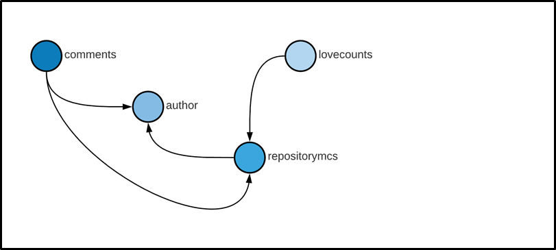
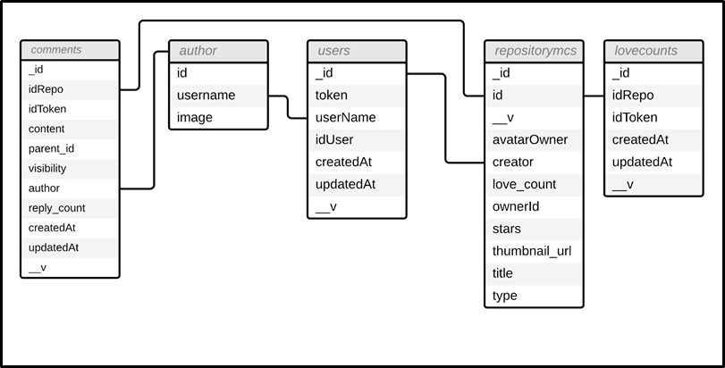
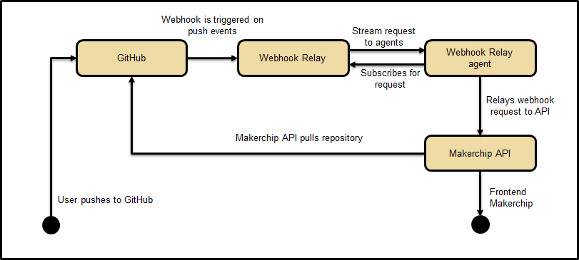

# Makerchip backend

Makerchip Community Platform is an open source web interface designed to allow users to share custom hardware designs using Makerchip's 
unique Electronic Design automation (EDA) propietary software and language which enables fast reliable unique design sharing for collaboration among 
developers. This repository contains the backend storage and connection structure with github's API.

## Architecture

  

Controler:
LoginController.js, GithubController.js, and LoginController.js
Models:
HookEvent.js, Comment.js, RepositoryMC.js, User.js, loveCount.js
Services:
GithubServices.js, WebHookEventService.js
Views:
Repository, hooks, getContentRepo, getAllRepo, getMyRepo, addLove, addComment

## Data Base Makerchip

  

  

## Webhooks Flow

  

## Context
Circuit design has been a game for big industry for far too long! Makerchip provides free and instant access to the latest tools from your browser 
and from your desktop. This includes open-source tools and proprietary ones. Turning the tables for the open-source community, Redwood EDA's commercial 
capabilities are often available for open-source development here first--*before* they are available commercially!
Learn more here https://www.redwoodeda.com

## Demo

- To see the community platform live click here http://167.99.15.99:8333
- Check out https://www.makerchip.com to create a design

## Getting started
- To run the project you will need Git, Node, mongodb, mongoose, and npm installed.

## Installation

1. Clone the repository.
2. Run `npm install` in the root folder.
3. Run `npm run dev` in the root folder.
4. Run `brew services start mongodb-community` for mac users, for windows and other users check [documentation](https://docs.mongodb.com/manual/tutorial/manage-mongodb-processes/)

## Environment variables

Create a .env file in the **root** folder with the following variables:

* PORT=

Github API keys:
* URL_LOGIN_GITHUB=
* API_GITHUB_SECRET=
* API_GITHUB_ID=

MongoDB connection credentials [documentation](https://docs.mongodb.com/manual/tutorial/manage-mongodb-processes/)
* MONGODB_URI2=
* MONGODB_URI=

Server variables:
* API_ORG_EXAMPLE=
* API_URL_GITHUB=
* PUBLIC_URL_DNS=
* FRONT_URL_DNS=
* SECRET_WORD_COOKIE=

## Built with

- [MongoDb](https://www.mongodb.com/) - Application database.
- [Mongoose](https://mongoosejs.com/) - Object document modeling (ODM) layer that sits on top of the Node.Js, and MongoDB API.
- [Express](https://expressjs.com/) - Framework layered on top of NodeJS, used to build the backend.
- [Node.js](https://nodejs.org/) - JavaScript runtime environment.

